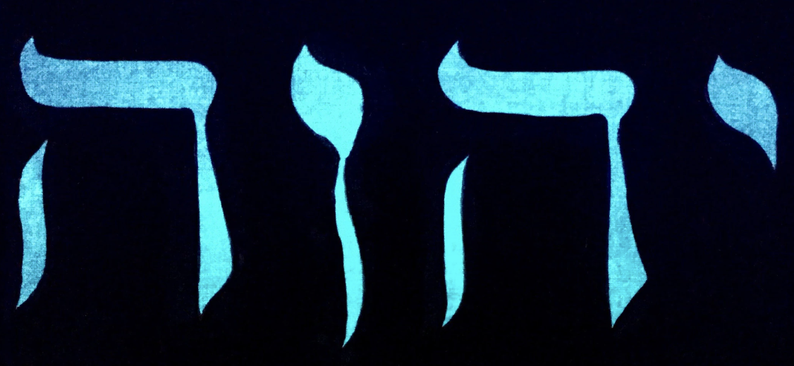
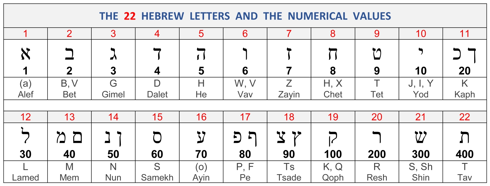

# El Reloj Áureo

[](https://rgkevin.github.io/golden-clock/)

Una exploración de cómo el [tetragrámaton](https://es.wikipedia.org/wiki/Tetragrámaton) **YHVH (10, 5, 6, 5)** aparece al transformar la [sucesión de Fibonacci](https://es.wikipedia.org/wiki/Sucesión_de_Fibonacci) mediante aritmética modular, agrupaciones y raíces digitales.

[Ver el reloj](https://rgkevin.github.io/golden-clock/)



## Ejecutar el proyecto

Necesitas Node.js y npm. Instala las dependencias e inicia el servidor:

```sh
npm ci
npm start
```

Para acceder también desde otro dispositivo de tu red local:

```sh
npm exec -- http-server . -a 0.0.0.0 -p 8080 -c-1
```

Abre `http://localhost:8080` en tu computadora. En otro dispositivo conectado a la misma red, usa `http://<IP-local-de-tu-computadora>:8080`. En el emulador de Android, usa `http://10.0.2.2:8080`.

El interruptor **Animación** está activado por defecto. Al desactivarlo, el reloj vuelve suavemente a su posición inicial por el recorrido más corto. Puedes reactivarlo incluso durante el regreso.

### Ejecutar desde Conductor

Usa el botón **Run** y selecciona **dev**. La configuración compartida está en `.conductor/settings.toml`: instala las dependencias con `npm ci` al crear el workspace y ejecuta el servidor en el puerto asignado por Conductor, con acceso desde la red local y sin caché.

La terminal muestra las direcciones disponibles. Para probarlo desde otro dispositivo, abre la dirección de red indicada y conecta ambos dispositivos a la misma red. En Android Emulator, usa `http://10.0.2.2:<puerto>` con el puerto mostrado por Conductor.

Conductor para Mac lee la configuración compartida desde la rama predeterminada remota una vez integrada. Para usarla antes de integrar los cambios, se puede guardar la misma configuración en `.conductor/settings.local.toml` dentro del repositorio principal; ese archivo se ignora en Git.

## La idea

En la gematría hebrea, cada letra del alfabeto tiene un valor numérico fijo. El nombre de Dios `יהוה` (YHVH) corresponde a:

| י (Yod) | ה (He) | ו (Vav) | ה (He) |
| --- | --- | --- | --- |
| 10 | 5 | 6 | 5 |

Al reducir la sucesión de Fibonacci módulo 10, se obtiene un **patrón de 60 dígitos que se repite**, conocido como período de Pisano:

```math
\pi(10) = 60
```

Dentro de esta estructura, al eliminar los múltiplos de 5, agrupar los valores, calcular sus raíces digitales y aplicar una suma acumulada cíclica, se obtiene la secuencia **10, 5, 6, 5**.

A continuación se muestran las operaciones y las decisiones del procedimiento de forma explícita, incluida la conservación del primer resultado, 10, sin reducirlo a un solo dígito.

## Desarrollo matemático

### Definiciones

**Definición 1 (sucesión de Fibonacci).** La sucesión $F = (F_n)_{n \geq 0}$ se define mediante:

```math
F_0 = 0, \qquad F_1 = 1, \qquad F_n = F_{n-1} + F_{n-2} \quad (n \geq 2)
```

**Definición 2 (período de Pisano).** Para un entero positivo $m$, el período de Pisano $\pi(m)$ es el menor entero $k > 0$ tal que:

```math
F_{n+k} \equiv F_n \pmod{m} \qquad \text{para todo } n \geq 0
```

Para el módulo 10, el período es 60. Esto significa que los últimos dígitos de la sucesión de Fibonacci se repiten cada 60 términos.

**Definición 3 (raíz digital).** Para un entero $n \geq 1$, la raíz digital $\operatorname{rd}(n)$ se obtiene sumando sus dígitos repetidamente hasta obtener un solo dígito. Para los múltiplos positivos de 9, el resultado es 9, no 0. De forma equivalente:

```math
\operatorname{rd}(n) =
\begin{cases}
9 & \text{si } n \equiv 0 \pmod{9}, \\
n \bmod 9 & \text{en otro caso}.
\end{cases}
```

**Definición 4 (sucesión base).** Sea $S$ un período completo de los últimos dígitos de Fibonacci:

```math
S = (F_0 \bmod 10,\ F_1 \bmod 10,\ \ldots,\ F_{59} \bmod 10)
```

Cada fila de la siguiente tabla continúa la anterior; los índices comienzan en 0.

| Índices | Dígitos, en orden |
| --- | --- |
| 0–14 | 0, 1, 1, 2, 3, 5, 8, 3, 1, 4, 5, 9, 4, 3, 7 |
| 15–29 | 0, 7, 7, 4, 1, 5, 6, 1, 7, 8, 5, 3, 8, 1, 9 |
| 30–44 | 0, 9, 9, 8, 7, 5, 2, 7, 9, 6, 5, 1, 6, 7, 3 |
| 45–59 | 0, 3, 3, 6, 9, 5, 4, 9, 3, 2, 5, 7, 2, 9, 1 |

```math
\lvert S \rvert = 60
```

### Paso 1: eliminar los múltiplos de 5

**Lema 1.** En $S$ hay exactamente 12 elementos que son múltiplos de 5: los dígitos 0 y 5. Al eliminarlos, quedan 48 elementos en la sucesión filtrada $S'$.

**Demostración.** Al contar las apariciones en $S$:

- El dígito **0** aparece en las posiciones 0, 15, 30 y 45: **4 veces**.
- El dígito **5** aparece en las posiciones 5, 10, 20, 25, 35, 40, 50 y 55: **8 veces**.

En total se eliminan 12 elementos:

```math
\lvert S' \rvert = 60 - (4 + 8) = 48
```

La sucesión filtrada conserva el orden original. Los guiones indican las posiciones eliminadas:

| Índices originales | Dígitos conservados y posiciones eliminadas |
| --- | --- |
| 0–14 | —, 1, 1, 2, 3, —, 8, 3, 1, 4, —, 9, 4, 3, 7 |
| 15–29 | —, 7, 7, 4, 1, —, 6, 1, 7, 8, —, 3, 8, 1, 9 |
| 30–44 | —, 9, 9, 8, 7, —, 2, 7, 9, 6, —, 1, 6, 7, 3 |
| 45–59 | —, 3, 3, 6, 9, —, 4, 9, 3, 2, —, 7, 2, 9, 1 |

### Paso 2: formar 12 grupos de 4 y calcular sus raíces digitales

**Definición 5.** Se divide $S'$ en 12 grupos consecutivos $G_1, \ldots, G_{12}$ de 4 elementos cada uno. Para cada grupo, se calcula:

```math
a_i = \operatorname{rd}\left(\sum_{x \in G_i} x\right)
```

La suma incluye todos los elementos del grupo, también los repetidos.

| Grupo | Elementos | Suma y reducción | Raíz digital |
| --- | --- | --- | --- |
| 1 | 1, 1, 2, 3 | 7 | **7** |
| 2 | 8, 3, 1, 4 | 16 → 1 + 6 | **7** |
| 3 | 9, 4, 3, 7 | 23 → 2 + 3 | **5** |
| 4 | 7, 7, 4, 1 | 19 → 1 + 9 → 10 → 1 + 0 | **1** |
| 5 | 6, 1, 7, 8 | 22 → 2 + 2 | **4** |
| 6 | 3, 8, 1, 9 | 21 → 2 + 1 | **3** |
| 7 | 9, 9, 8, 7 | 33 → 3 + 3 | **6** |
| 8 | 2, 7, 9, 6 | 24 → 2 + 4 | **6** |
| 9 | 1, 6, 7, 3 | 17 → 1 + 7 | **8** |
| 10 | 3, 3, 6, 9 | 21 → 2 + 1 | **3** |
| 11 | 4, 9, 3, 2 | 18 → 1 + 8 | **9** |
| 12 | 7, 2, 9, 1 | 19 → 1 + 9 → 10 → 1 + 0 | **1** |

Resultado:

```math
A = (7, 7, 5,\ 1, 4, 3,\ 6, 6, 8,\ 3, 9, 1)
```

### Paso 3: formar 4 grupos de 3 y calcular sus raíces digitales

**Definición 6.** Se divide $A$ en 4 grupos consecutivos $H_1, H_2, H_3, H_4$ de 3 elementos cada uno. Para cada grupo, se calcula:

```math
b_j = \operatorname{rd}\left(\sum_{x \in H_j} x\right)
```

| Grupo | Elementos | Suma y reducción | Raíz digital |
| --- | --- | --- | --- |
| 1 | 7, 7, 5 | 19 → 1 + 9 → 10 → 1 + 0 | **1** |
| 2 | 1, 4, 3 | 8 | **8** |
| 3 | 6, 6, 8 | 20 → 2 + 0 | **2** |
| 4 | 3, 9, 1 | 13 → 1 + 3 | **4** |

Resultado:

```math
B = (b_1, b_2, b_3, b_4) = (1, 8, 2, 4)
```

### Paso 4: suma acumulada cíclica y correspondencia con el tetragrámaton

Partiendo de $b_2 = 8$, se suman los elementos de $B$ de forma cíclica: primero $b_3$, después $b_4$, luego $b_1$ y, finalmente, otra vez $b_2$.

Se usa $C_i$ para las sumas acumuladas sin reducir y $Y_i$ para los valores finales. **La primera suma se conserva como 10**; a las otras tres se les aplica la raíz digital.

```math
\begin{aligned}
C_1 &= b_2 + b_3 = 8 + 2 = 10 \\
C_2 &= C_1 + b_4 = 10 + 4 = 14 \\
C_3 &= C_2 + b_1 = 14 + 1 = 15 \\
C_4 &= C_3 + b_2 = 15 + 8 = 23
\end{aligned}
```

```math
\begin{aligned}
Y_1 &= C_1 = \mathbf{10} \\
Y_2 &= \operatorname{rd}(C_2) = 1 + 4 = \mathbf{5} \\
Y_3 &= \operatorname{rd}(C_3) = 1 + 5 = \mathbf{6} \\
Y_4 &= \operatorname{rd}(C_4) = 2 + 3 = \mathbf{5}
\end{aligned}
```

Las letras hebreas se muestran por separado para conservar su dirección de lectura y evitar mezclarlas con la notación matemática:

| Posición | Valor | Letra hebrea | Nombre |
| --- | --- | --- | --- |
| 1 | 10 | י | Yod |
| 2 | 5 | ה | He |
| 3 | 6 | ו | Vav |
| 4 | 5 | ה | He |

La secuencia resultante corresponde a YHVH (`יהוה`):

```math
\boxed{(10,\ 5,\ 6,\ 5)}
```

## Resultado

El procedimiento descrito obtiene los valores del tetragrámaton a partir de un período de Fibonacci módulo 10. El resultado depende de las agrupaciones indicadas, del punto de inicio de la suma cíclica y de conservar el primer 10 sin reducirlo.

Encontré esta relación durante la cuarentena de 2020. Desde entonces he explorado otras propiedades de esta sucesión, incluidas posibles conexiones entre el período de Pisano, las raíces digitales y la distribución de los números primos. Una demostración más profunda sigue en desarrollo.

## Formato de las fórmulas

Las ecuaciones usan bloques `math` y las expresiones en línea usan delimitadores `$`, según la [sintaxis matemática compatible con GitHub](https://docs.github.com/es/get-started/writing-on-github/working-with-advanced-formatting/writing-mathematical-expressions). Para verlas en un editor local, la vista previa de Markdown debe admitir notación matemática.

---

Derechos de autor: Kevin López | 2023
